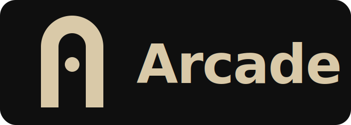

<p align="center">
  
</p>

<p align="center">
  <b>Multi-agent workspace for Claude Code — launch and arrange parallel sessions with tmux-style splits.</b>
</p>

<p align="center">
  <a href="https://github.com/quietforkTsuruta0821/arcade/releases/latest"></a>
  <a href="LICENSE"></a>
  <a href="https://github.com/quietforkTsuruta0821/arcade/stargazers"></a>
  
</p>

<!-- HERO_VIDEO: replace with a 90-second YouTube or Loom demo. Pattern below shows a clickable YouTube thumbnail. -->
<!--
<p align="center">
  <a href="https://youtu.be/REPLACE_WITH_VIDEO_ID">
    
  </a>
</p>
-->

---

## What is Arcade?

Arcade is a desktop launcher for Claude Code. Register your projects once, then start a Claude session in any of them with a single click. Each session opens in its own pane. Split panes left/right or top/bottom — like tmux, but with a mouse and no config file.

It runs natively on Windows and macOS. The whole app is one binary plus a `~/.arcade/` config folder.

## Highlights

- **Project catalog.** Register a local folder, give it a name. One click runs `claude --dangerously-skip-permissions` in that folder.
- **Tmux-style splits.** Drag a pane header to split it horizontally or vertically. No grid cells — panes can be any size.
- **Multi-window.** Open the same projects in two windows side by side. One window writes; the other syncs live via file watching.
- **File explorer + Markdown reader.** A VS Code-style sidebar shows files in the active pane's folder. Click a `.md` to open it in a side panel.
- **Persistent layouts.** Save named layouts (`"Trading"`, `"Shogun"`) and reload them later.
- **Stays out of the way.** Dark theme. JetBrains Mono. No telemetry. No login.

## Screenshots

<!-- SCREENSHOT_1: main window with 4 panes running claude in parallel — wide hero shot -->
<!-- caption: Four Claude Code sessions, one per project, arranged in a split tree. -->

<!-- SCREENSHOT_2: project sidebar with the "+ Add" dialog open -->
<!-- caption: Register a project by picking a folder. Name it whatever you want. -->

<!-- SCREENSHOT_3: a pane being resized (mid-drag, divider visible) -->
<!-- caption: Drag dividers to resize. The PTY follows in real time. -->

<!-- SCREENSHOT_4: file explorer view with markdown reader open on the right side -->
<!-- caption: Browse files in the active project. Click a .md to read it next to your terminal. -->

<!-- SCREENSHOT_5: two Arcade windows side by side, same project list, different layouts -->
<!-- caption: Multi-window mode. Same projects, separate layouts, live sync via fsnotify. -->

<!-- SCREENSHOT_6: settings dialog showing font and theme controls -->
<!-- caption: Font, theme, default command. Stored as plain JSON in ~/.arcade/. -->

## Quick start

### Windows

1. Download `Arcade-Setup-vX.Y.Z.exe` from [Releases](https://github.com/quietforkTsuruta0821/arcade/releases/latest).
2. Run the installer. SmartScreen will warn you — click **More info → Run anyway**. The binary is unsigned for now (see [DECISIONS.md](DECISIONS.md)).
3. Launch Arcade. Add a project. Click it. You're in.

### macOS

1. Download `Arcade-vX.Y.Z-universal.dmg` from [Releases](https://github.com/quietforkTsuruta0821/arcade/releases/latest).
2. Open the DMG and drag **Arcade.app** to `/Applications`.
3. First launch is blocked by Gatekeeper. Remove the quarantine flag once:

   ```bash
   xattr -d com.apple.quarantine /Applications/Arcade.app
   ```

   Then open it normally.

### Requirements

- **Claude Code** installed and available on your `PATH`. Arcade does not bundle it. Check with `claude --version`.
- Windows 10/11 (x64) or macOS 10.15+ (Intel or Apple Silicon).

### Linux

Linux is not part of the first release. The codebase already builds on Linux (`wails build -platform linux/amd64`), but it has not been tested on real hardware. If you want to try it, build from source and please file an issue with what you see.

## How it compares

|                                   | Arcade | tmux | VS Code Terminal | Warp |
|-----------------------------------|:------:|:----:|:----------------:|:----:|
| Multi-pane splits                 |   ✓    |  ✓   |    partial       |  ✓   |
| Project catalog (1-click launch)  |   ✓    |  —   |    partial       |  —   |
| Claude Code launch built-in       |   ✓    |  —   |    —             |  —   |
| Layout persists across restarts   |   ✓    | manual | ✓              |  —   |
| Native desktop app                |   ✓    |  —   |    ✓             |  ✓   |

## Roadmap

- **v1.0** — Project catalog, tmux-style splits, multi-window, file explorer, Markdown reader, named layouts. *(this release)*
- **v1.x** — Linux build (AppImage), screen lock for sensitive sessions, command palette, drag-and-drop project ordering.
- **Future** — A team mode with shared catalogs is being explored. No promised timeline.

## License

MIT. See [LICENSE](LICENSE).

## Contributing

Issues and PRs are welcome. When reporting a bug, please include:

- OS and version
- Claude Code version (`claude --version`)
- Steps to reproduce
- What you expected vs. what actually happened

If you find Arcade useful, please give it a ⭐ — it helps other Claude Code users find the project.

## Acknowledgements

Arcade is built with:

- [Wails](https://wails.io/) — Go + WebView desktop framework
- [go-pty](https://github.com/aymanbagabas/go-pty) — cross-platform PTY (ConPTY on Windows)
- [xterm.js](https://xtermjs.org/) — terminal renderer (also used inside VS Code)
- [React](https://react.dev/) + TypeScript on the frontend

The split-pane layout is modeled on tmux. The activity bar and file explorer borrow patterns from VS Code. The original grid concept came from Apache Superset — see [DECISIONS.md](DECISIONS.md) for the full story.
